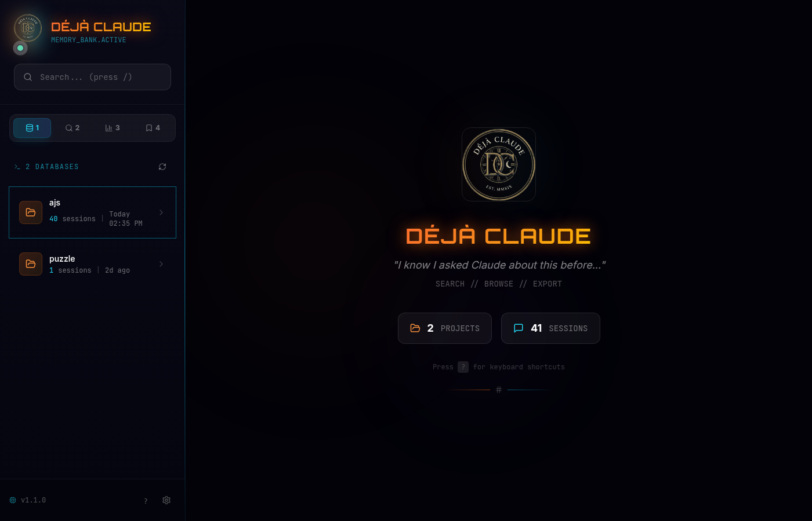
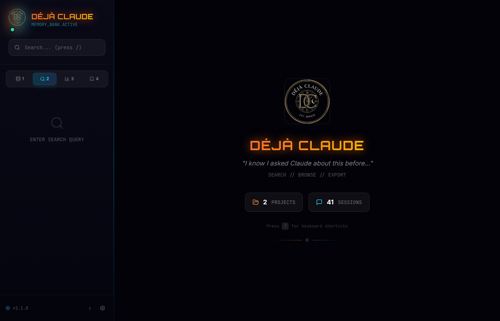
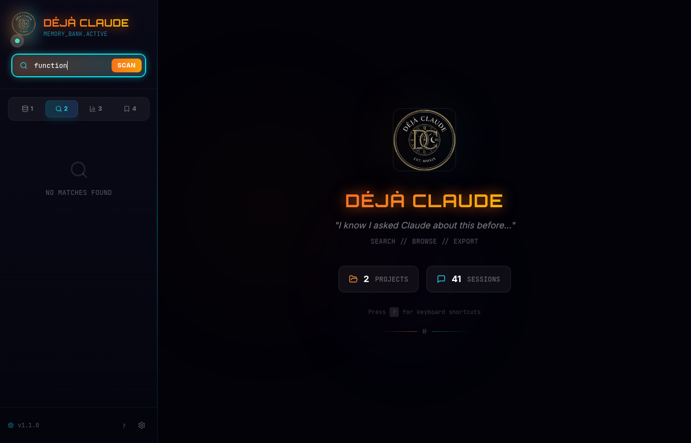
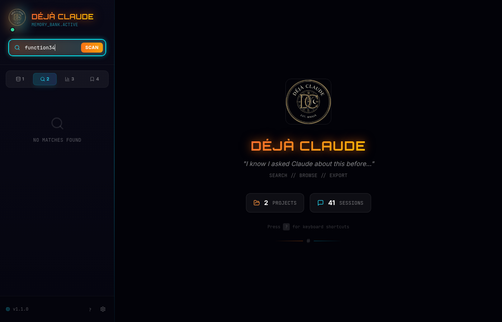

<p align="center">
  
</p>

<h1 align="center">Déjà Claude</h1>

<p align="center">
  <strong>"I know I asked Claude about this before..."</strong>
  <br>
  <em>Stop digging through files. Find any conversation in seconds.</em>
</p>

<p align="center">
  <a href="#-the-problem">The Problem</a> •
  <a href="#-features">Features</a> •
  <a href="#-quick-start">Quick Start</a> •
  <a href="#-keyboard-shortcuts">Shortcuts</a> •
  <a href="#-screenshots">Screenshots</a>
</p>

<p align="center">
  
  
  
  
  
  
</p>

---

## The Problem

You've been using **Claude Code** for weeks. Hundreds of conversations. Thousands of brilliant solutions.

Now you need to find that *one* session where Claude helped you set up authentication, write that perfect regex, or debug that migration.

**Your options today:**

| What You Do | How It Feels |
|-------------|--------------|
| Browse `~/.claude/projects/` | *"Which folder was it again..."* |
| Open random `.jsonl` files | *"This isn't it... this isn't it either..."* |
| `grep` through JSON blobs | *"I can't read any of this"* |
| Ask Claude again | *"Didn't we already solve this?"* |

---

## The Solution

**Déjà Claude** — A futuristic cyberpunk interface to search, browse, and export your Claude Code history.

```
╭──────────────────────────────────────────────────────────────────────────────╮
│  ┌─────────────────────────────────────────────────────────────────────────┐ │
│  │  🔍 authentication jwt token                          [12/01] → [12/20] │ │
│  └─────────────────────────────────────────────────────────────────────────┘ │
├─────────────────────────┬────────────────────────────────────────────────────┤
│                         │                                                    │
│  ╔═══════════════════╗  │  ⚡ API Authentication Setup                       │
│  ║ 📁 PROJECTS       ║  │  ━━━━━━━━━━━━━━━━━━━━━━━━━━━━━━━━━━━━━━━━━━━━━━━━ │
│  ║ 🔍 SEARCH         ║  │  Dec 15 • 47 messages                  ★ [Export] │
│  ║ 📊 STATISTICS     ║  │                                                    │
│  ║ ★  BOOKMARKS      ║  │  ┌──────────────────────────────────────────────┐  │
│  ╚═══════════════════╝  │  │ 👤 You                            2:34 PM    │  │
│                         │  │ How do I implement JWT auth with refresh...  │  │
│  ──────────────────     │  └──────────────────────────────────────────────┘  │
│  myapp (12 sessions)    │                                                    │
│  api-server (8)         │  ┌──────────────────────────────────────────────┐  │
│  web-frontend (5)       │  │ 🤖 Claude                          2:35 PM   │  │
│                         │  │ I'll help you implement secure JWT auth.     │  │
│  ──────────────────     │  │ Here's a complete implementation...          │  │
│  📅 Dec 15              │  │                                              │  │
│  ├─ API Auth Setup  ★   │  │ ▼ Tool: Write [src/auth/jwt.ts]             │  │
│  └─ Database Schema     │  └──────────────────────────────────────────────┘  │
│                         │                                                    │
│  [?] Keyboard shortcuts │                    Press ? for keyboard shortcuts  │
╰─────────────────────────┴────────────────────────────────────────────────────╯
```

---

## Features

### Full-Text Search
Search across **all** your Claude sessions simultaneously with instant results. Context previews show exactly what you're clicking.

### Date Range Filters
Filter sessions by date range. Perfect for finding "that conversation from last week" or reviewing a specific time period.

### Statistics Dashboard
Track your Claude usage patterns:
- Total projects, sessions, and messages
- Activity heatmap over time
- Peak usage hours
- Sessions per day breakdown

### Bookmarks
Save important sessions for quick access later. Bookmarks persist in your browser's local storage.

### Keyboard Navigation (Vim-style)
Navigate the entire app without touching your mouse:

| Key | Action |
|-----|--------|
| `j` / `k` | Navigate up/down in lists |
| `Enter` | Select item |
| `Esc` | Go back / Close |
| `b` | Toggle bookmark |
| `e` | Export session |
| `/` | Focus search |
| `?` | Show shortcuts help |
| `1-4` | Switch tabs |

### Jump to Exact Match
Click a search result → land directly on that message with animated highlighting. No more scrolling through 500-message sessions.

### Smart Filtering
Automatically hides noise:
- Warmup sessions (`"warmup"`, `"test"`, `"hi"`)
- Sessions with only 1-2 messages
- Empty or trivial conversations

### Search Highlighting
- **Cyan highlight** on matching text
- **Glowing border** on messages containing matches
- **"Match" badge** for quick visual scanning
- **Animated ring** when jumping to a message

### Complete Export
Export any session as formatted Markdown with:
- Full tool inputs and outputs
- Timestamps on every message
- Message numbers for reference
- Code blocks preserved
- Collapsible tool details

> **Note:** Export may take up to 60 seconds for large sessions while converting.

### Cyberpunk Theme
Futuristic UI with animated backgrounds, neon glows, and glassmorphism effects. Easy on the eyes at 2 AM.

### Zero Configuration
Just run it. Déjà Claude finds your history at `~/.claude/projects/` automatically.

---

## Quick Start

```bash
# Clone the repo
git clone https://github.com/consigcody94/deja-claude.git
cd deja-claude

# Install dependencies
npm install

# Launch
npm run dev
```

Open **http://localhost:5173** — start searching!

---

## Keyboard Shortcuts

Press `?` anywhere in the app to see all shortcuts:

```
╭─────────────────────────────────────────╮
│           ⌨️ KEYBOARD SHORTCUTS         │
├─────────────────────────────────────────┤
│                                         │
│  NAVIGATION                             │
│  ─────────                              │
│  j / ↓      Move down                   │
│  k / ↑      Move up                     │
│  Enter      Select item                 │
│  Esc        Go back / Close             │
│                                         │
│  ACTIONS                                │
│  ───────                                │
│  b          Toggle bookmark             │
│  e          Export session              │
│  /          Focus search                │
│  ?          Show this help              │
│                                         │
│  VIEWS                                  │
│  ─────                                  │
│  1          Projects tab                │
│  2          Search tab                  │
│  3          Statistics tab              │
│  4          Bookmarks tab               │
│                                         │
╰─────────────────────────────────────────╯
```

---

## Screenshots

### Project Browser
Browse all your Claude projects with the cyberpunk-themed interface.



### Search
Full-text search across all sessions with real-time results.



### Search Results
Context previews show matching text with surrounding content.



### Statistics Dashboard
Track your Claude usage patterns and activity over time.


### Bookmarks
Save important sessions for quick access later.



### Keyboard Shortcuts
Press `?` to see all Vim-style keyboard shortcuts.


---

## How It Works

Déjà Claude reads your existing Claude Code history. **It never modifies anything** — purely read-only.

```
~/.claude/projects/
├── -home-user-myproject/          # URL-encoded project paths
│   ├── session-abc123.jsonl       # Conversation logs
│   ├── session-def456.jsonl
│   └── ...
└── -home-user-another/
    └── ...
```

The JSONL files contain your full conversation history. Déjà Claude parses them into a searchable, browsable interface.

---

## Architecture

```
deja-claude/
├── backend/                 # Node.js + Express
│   └── src/
│       ├── server.ts       # HTTP server & API routes
│       └── history.ts      # JSONL parser & search engine
│
├── frontend/               # React 18 + Vite + Tailwind
│   └── src/
│       ├── App.tsx         # Main application (1000+ lines)
│       └── index.css       # Cyberpunk theme styles
│
└── package.json            # Monorepo workspace root
```

| Layer | Tech | Purpose |
|-------|------|---------|
| **API** | Express | REST endpoints for projects, sessions, search |
| **Parser** | Custom | JSONL parsing, content extraction, deduplication |
| **Search** | In-memory | Full-text search with match context extraction |
| **UI** | React + Tailwind | Cyberpunk-themed responsive interface |
| **State** | React hooks + localStorage | Bookmarks, preferences |

---

## Requirements

- **Node.js** 18+
- **Claude Code CLI** with existing conversation history
- A modern browser (Chrome, Firefox, Safari, Edge)

---

## Development

```bash
# Development mode with hot reload
npm run dev

# Build for production
npm run build

# Start production server
npm start
```

The dev server runs:
- **Frontend**: http://localhost:5173 (Vite)
- **Backend**: http://localhost:3001 (Express)

---

## Feature Checklist

- [x] Full-text search across all sessions
- [x] Date range filtering
- [x] Statistics dashboard
- [x] Bookmarks with localStorage persistence
- [x] Vim-style keyboard navigation
- [x] Complete export with tool details
- [x] Cyberpunk UI theme
- [x] Jump to exact search match
- [x] Smart session filtering
- [ ] Full-text SQLite index for massive histories
- [ ] Custom themes
- [ ] Session diffing

---

## Why "Déjà Claude"?

**Déjà vu** (French: *"already seen"*) — that eerie feeling you've experienced something before.

**Déjà Claude** — that *certain* feeling you've asked Claude about this before... and now you can finally find it.

---

## Contributing

Contributions welcome! Feel free to:
- Report bugs
- Suggest features
- Submit PRs

---

## License

MIT License — do whatever you want with it.

---

<p align="center">
  <strong>Built for Claude Code power users who refuse to lose their conversation history.</strong>
  <br><br>
  <em>Stop searching. Start finding.</em>
  <br><br>
  <a href="../../stargazers">Star this repo</a> if Déjà Claude saved you time!
</p>
